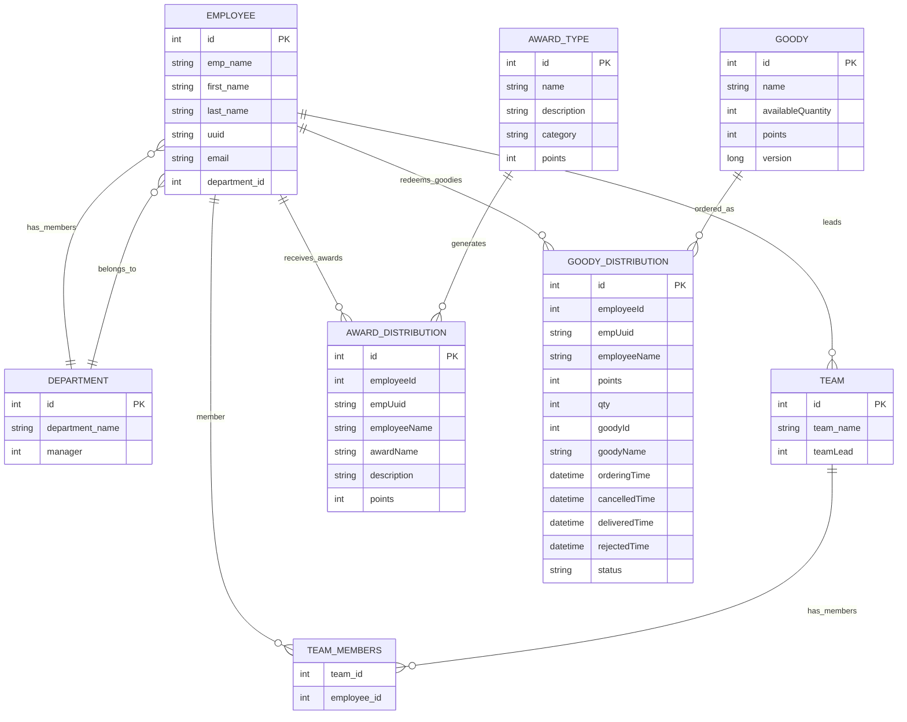
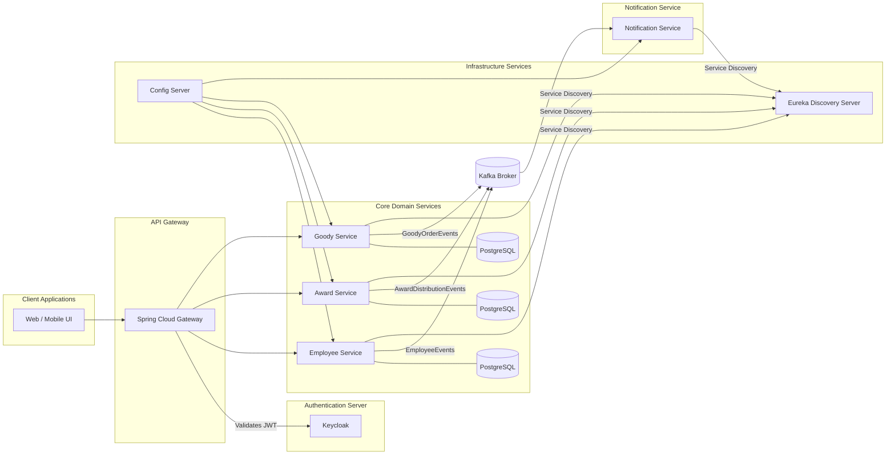

# Applause -- Employee Rewards & Goodies Platform

A microservices-based corporate reward management system built with
Spring Boot, Kafka, Keycloak, and Docker Compose.

---

## 📑 Table of Contents

1. [x] [Overview](#overview)
2. [x] [Architecture](#architecture)
3. [x] [Tech Stack](#tech-stack)
4. [x] [Running the Project](#run)
5. [x] [security](#security)
6. [x] [Combined ERD Data Model](#db-design)
7. [x] [Overall System Design](#system-design)
8. [x] [Event Driven Flow](#ED-flow)
8. [x] [API Documentation](#api-documentation)
9. [x] [Future Scope](#future-scope)
10. [x] [Contribution](#contribution)
11. [x] [License](#license)

---

<h2 id="overview">Overview</h2>

Applause is a complete rewards & goodies platform for corporate
employees. Employees earn points through awards and redeem those points
for goodies.

This project demonstrates real-world enterprise architecture using: -
Spring Boot Microservices - Kafka for asynchronous events - Keycloak for
authentication & RBAC - Spring Cloud Gateway, Eureka, Config Server -
Docker Compose for orchestration

---

<h2 id="architecture">Architecture</h2>

### Core Domain Services

#### 1. Employee Service

- Manages Employees, Departments, Teams
- Stores employee profiles
- Have constant communication with Auth-server for syncing new user registration and User's data updation
- Dashboards for HR & Admin (Future)
- Not Limited only to this APPLAUSE project
- Potentially can be utilised further by any other microservice which needs employee information, as this service has broader scope of usage.(HR Payroll-service, Proj-Management-service(jira like systems), Pantry-service, etc..)

#### 2. Award Service

- Manages Different Award Types
- Grants awards with points
- Manages Award Distribution data upon Award being granted
- Publishes AwardGrantedEvent for Individual, Team, Department awards to Kafka

#### 3. Goody Service

- Manages Goodies catalog
- Employees redeem points from points carried by awards for goodies
- Manages Goody Distribution data and its status
- Publishes OrderPlaced, OrderCancelled, OrderDelivered events to Kafka

#### 4. Notification Service

- Event Driven system, powered by Kafka
- For sending Mail Notifications upon events mentioned from Award, Goody service.
- Future Scope: Shall have persistent Data for Mail resend and remainder mails, etc.

### Supporting Services

- Keycloak Authentication Server
- API Gateway
- Eureka Discovery Server
- Config Server

---

<h2 id="tech-stack">Tech Stack</h2>

- Java 17 / Spring Boot
- Spring Cloud (Gateway, Config, Eureka Discovery)
- Spring Security (OAuth & RBAC)
- Auth Server (Keycloak)
- Kafka (for Event Driven workflows)
- PostgreSQL
- Docker Compose

<h2 id="run">Running the Project</h2>

- Project can be run using Docker.
- To Run this Project locally, separate DEMO environment is configured.
- Before starting, Please ensure below mentioned Access Points are available and not busy.

### 1. Clone the Repo

    git clone https://github.com/AnbuGanesanB/Applause.git
    cd Applause

### 2. Verify necessary files exist

- Ensure '.env.demo' ENV file is present
- Inside there must be a variable (COMPOSE_PROJECT_NAME=applause-demo). 
- Verify Keycloak import files exist (keycloak-import/Realm_Study-realm.json & keycloak-import/Realm_Study-users-0.json)
- Above files are important to import pre-configured Keycloak Realm

### 3. Ensure Clean docker state

    docker compose --env-file .env.demo -f docker-compose-demo.yml down -v

### 4. Start the demo stack

    docker compose --env-file .env.demo -f docker-compose-demo.yml up -d
- wait for 8-10 mins depending on machine's capacity to ensure all the services are up and running.
- Services must be running in below mentioned ports.

### 5. Access Points (Configured in DEMO env)

- Gateway Server: http://localhost:8222
- Config Server: http://localhost:8888
- Keycloak Admin: http://localhost:8080
- Eureka: http://localhost:8761
- Employee Service: http://localhost:8050 
- Award Service: http://localhost:8060
- Goody Service: http://localhost:8070
- Notification Service: http://localhost:8040
- PG Admin: http://localhost:5050 (shall configure running DB and view)
- Mail Dev Service: http://localhost:1025 (Intercepts Mail)
- Mail Dev UI: http://localhost:1080 (To check Mail)

### 6. Access the Keycloak 

- Username: admin
- Password: admin

Verify the following:

- Realm Realm_Study exists
- Users are present
- Clients exist
- Client secrets are same as mentioned in '.env.demo'

### 7. Configure OAuth2.0 Token

Preferably send as Request Header with Prefix 'Bearer'

#### As User: (To access resource server APIs like Employee,Award,Goodies)

- Grant Type: Password Credentials
- Access Token URL: http://localhost:8080/realms/Realm_Study/protocol/openid-connect/token
- Client ID: employee_service
- Client Secret: imBdba5w1MBmlarVqRP6ywtxX5gbCW1c (crosscheck with keycloak directly)
- Username: alice (Or any other user)
- Password: alice (password same as username)

#### As Service: (To access Keycloak APIs directly)

- Grant Type: Client Credentials
- Access Token URL: http://localhost:8080/realms/Realm_Study/protocol/openid-connect/token
- Client ID: employee_service
- Client Secret: imBdba5w1MBmlarVqRP6ywtxX5gbCW1c (crosscheck with keycloak directly)

### 9. Shutdown all services

    docker compose --env-file .env.demo -f docker-compose-demo.yml down

---

<h2 id="security">Security</h2>

Authentication via Keycloak with JWT-based RBAC: 
- Roles defined in Auth-server: (hr / manager / staff)
- An Employee/User must always be in any one of above listed roles

---

<h2 id="db-design">Database Design (Combined ER Diagrams)</h2>

Application follows DB per service design.

- Entities of Employee, Award, Goodies DBs are indicated
- Employee service: Employee, Team, Department, TeamMembers tables
- Award service: AwardType, AwardDistribution
- Goody service: Goody, GoodyDistribution

---

config:
layout: elk

---

---

<h2 id="system-design">Overall System Architecture Diagram</h2>

config:
layout: elk

---

<h2 id="ED-flow">Event-Driven Flow (Kafka)</h2>

| Event Name                | Produced By      | Consumed By                   | Purpose                                    |
| ------------------------- | ---------------- | ----------------------------- | ------------------------------------------ |
| IndlAwardDistributedEvent | Award Service    | Notification Service          | Notify employee & update points            |
| DeptAwardDistributedEvent | Award Service    | Notification Service          | Notify Dept employees & update points      |
| TeamAwardDistributedEvent | Award Service    | Notification Service          | Notify team members & update points        |
| GoodyOrderedEvent         | Goody Service    | Notification Service          | confirmation mail about New order          |
| OrderDeliveredEvent       | Goody Service    | Notification Service          | confirmation mail about order delivery     |
| OrderCancelledEvent       | Goody Service    | Notification Service          | confirmation mail about order cancellation |
| NewUserAddedEvent         | Employee Service | Award & Notification Services | Notify employee & Add Welcome Award        |
| UserDataModifiedEvent     | Employee Service | Notification Service          | Notification mail with new details         |

---

<h2 id="api-documentation">API Documentation</h2>

👉 [View API Documentation](https://documenter.getpostman.com/view/47323157/2sB3dPQpWD)

---

<h2 id="future-scope">Future Enhancements</h2>

- Add distributed tracing (Zipkin/OpenTelemetry)
- Add Grafana & Prometheus monitoring
- Add Admin UI (Angular/React)
- Add Frontend dashboard for all staffs (Angular/React)
- Add DLQ handling for Kafka
- Persistence layer for Notification service to process Mail Resend, follow-up mails, remainder mails etc

---

<h2 id="contribution">Contribution</h2>

This is a personal project meant for learning and showcasing skills, but feel free to fork and experiment.

---

<h2 id="license">License</h2>

MIT — Free to use for personal and professional demos.
