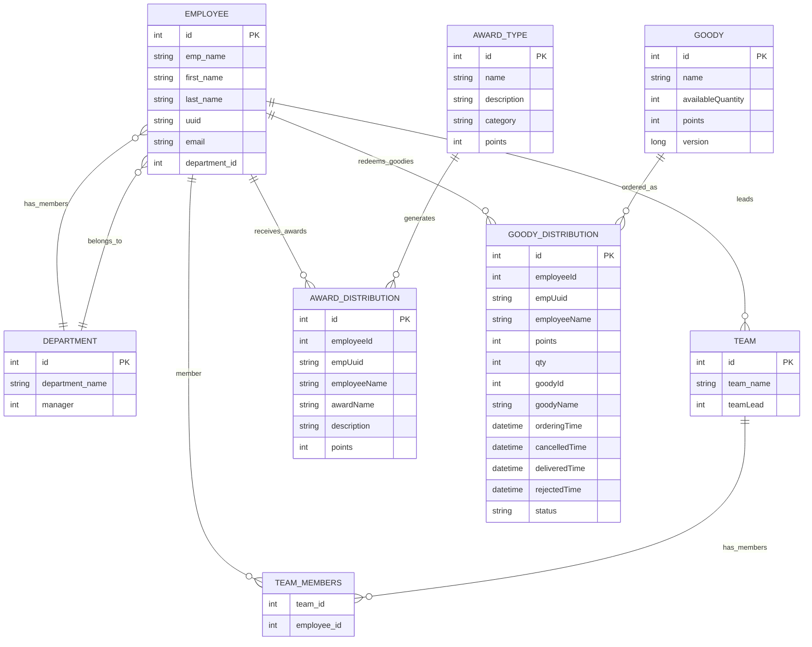
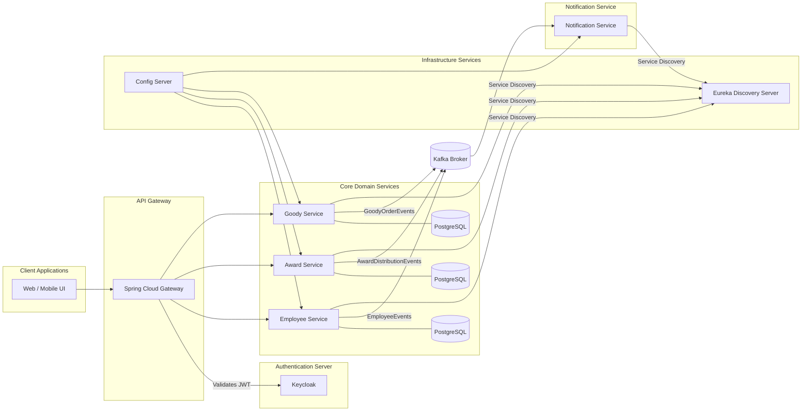

# Applause -- Employee Rewards & Goodies Platform

A microservices-based corporate reward management system built with
Spring Boot, Kafka, Keycloak, and Docker Compose.

---

## Overview

Applause is a complete rewards & goodies platform for corporate
employees. Employees earn points through awards and redeem those points
for goodies.

This project demonstrates real-world enterprise architecture using: -
Spring Boot Microservices - Kafka for asynchronous events - Keycloak for
authentication & RBAC - Spring Cloud Gateway, Eureka, Config Server -
Docker Compose for orchestration

---

## Architecture

### Core Domain Services

#### 1. Employee Service

- Manages Employees, Departments, Teams
- Stores employee profiles
- Have constant communication with Auth-server for syncing new user registration and User's data updation
- Dashboards for HR & Admin (Future)
- Not Limited only to this APPLAUSE project
- Potentially can be utilised further by any other microservice which needs employee information, as this service has broader scope of usage.(HR Payroll-service, Proj-Management-service(jira like systems), Pantry-service, etc..)

#### 2. Award Service

- Manages Different Award Types
- Grants awards with points
- Manages Award Distribution data on each award
- Publishes AwardGrantedEvent for Individual, Team, Department awards to Kafka

#### 3. Goody Service

- Manages Goodies catalog
- Employees redeem points from points carried by awards for goodies
- Manages Goody Distribution data and its status
- Publishes OrderPlaced, OrderCancelled, OrderDelivered events to Kafka

### Supporting Services

- Notification Service (Kafka → Email)
- API Gateway
- Eureka Discovery Server
- Config Server
- Keycloak Authentication Server

---

## Tech Stack

- Java 17 / Spring Boot
- Spring Cloud (Gateway, Config, Eureka Discovery)
- Spring Security (OAuth & RBAC)
- Auth Server (Keycloak)
- Kafka (for Event Driven workflows)
- PostgreSQL
- Docker Compose

## Running the Project

### 1. Clone the Repo

    git clone https://github.com/your-username/applause.git
    cd applause

### 2. Start All Services

    docker compose up --build

### 3. Access Points

- Eureka: http://localhost:8761/
- Keycloak Admin: http://localhost:8080/

---

## Security

Authentication via Keycloak with JWT-based RBAC: - ROLE_EMPLOYEE -
ROLE_HR - ROLE_ADMIN

---

## Database Design (Combined ER Diagrams)

Application follows DB per service design.

- Entities of Employee, Award, Goodies DBs are indicated
- Employee service: Employee, Team, Department, TeamMembers tables
- Award service: AwardType, AwardDistribution
- Goody service: Goody, GoodyDistribution

---

config:
layout: elk

---

---

## Overall System Architecture Diagram

config:
layout: elk

---

## Event-Driven Flow (Kafka)

| Event Name                | Produced By      | Consumed By                   | Purpose                                    |
| ------------------------- | ---------------- | ----------------------------- | ------------------------------------------ |
| IndlAwardDistributedEvent | Award Service    | Notification Service          | Notify employee & update points            |
| DeptAwardDistributedEvent | Award Service    | Notification Service          | Notify Dept employees & update points      |
| TeamAwardDistributedEvent | Award Service    | Notification Service          | Notify team members & update points        |
| GoodyOrderedEvent         | Goody Service    | Notification Service          | confirmation mail about New order          |
| OrderDeliveredEvent       | Goody Service    | Notification Service          | confirmation mail about order delivery     |
| OrderCancelledEvent       | Goody Service    | Notification Service          | confirmation mail about order cancellation |
| NewUserAddedEvent         | Employee Service | Award & Notification Services | Notify employee & Add Welcome Award        |
| UserDataModifiedEvent     | Employee Service | Notification Service          | Notification mail with new details         |

---

## API Documentation

👉 [View API Documentation](https://documenter.getpostman.com/view/47323157/2sB3dPQpWD)

---

## Future Enhancements

- Add distributed tracing (Zipkin/OpenTelemetry)
- Add Grafana & Prometheus monitoring
- Add Admin UI (Angular/React)
- Add Frontend dashboard for all staffs (Angular/React)
- Add DLQ handling for Kafka
- Persistance layer for Notification service to process Mail Resend, follow-up mails, remainder mails etc

---

<h2 id="contribution">🙌 Contribution</h2>

This is a personal project meant for learning and showcasing skills, but feel free to fork and experiment.

---

<h2 id="license">📄 License</h2>

MIT — Free to use for personal and professional demos.
